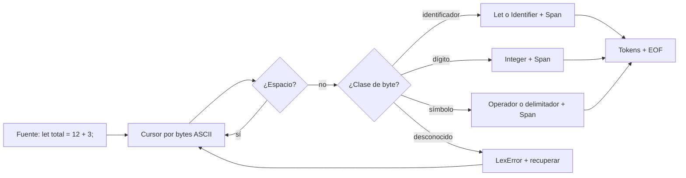

# 01. Lexer: del texto a tokens con ubicación

**Estado:** draft  
**Modelo:** [`src/lexer.rs`](../src/lexer.rs)  
**Especificación:** [contrato del lexer](specifications/01-lexer.md)

## Concepto

Un lexer convierte la secuencia de caracteres de un programa en una secuencia
de tokens. Un token no es solo su clase: conserva un `Span`, el rango de bytes
del que provino. Así, las etapas posteriores reciben `Identifier("total")` o
`Integer(12)` en lugar de tener que volver a recorrer caracteres y espacios.

## Problema

El parser necesita razonar sobre estructura, no sobre detalles locales como si
`12` ocupa uno o varios bytes o si había espacios antes de `+`. Sin una frontera
clara, el parser mezcla reconocimiento de caracteres, precedencia y mensajes de
error; el resultado se vuelve difícil de extender y de diagnosticar.

El lexer resuelve esa frontera con tres promesas:

1. Cada token reconocido conserva un `Span` con final exclusivo.
2. Los espacios no producen tokens del lenguaje inicial.
3. Un byte desconocido produce un diagnóstico y no detiene el reconocimiento
   de los tokens siguientes.

## Alternativas y decisión

| Alternativa | Ventaja | Límite | Decisión |
|---|---|---|---|
| Recorrido manual por bytes | Spans y recuperación explícitos | Más código inicial | Adoptada |
| Expresiones regulares | Sintaxis compacta | Ocultan control de offsets y recuperación | Diferida |
| Soporte Unicode completo | Identificadores más amplios | Exige una política de offsets y categorías | Fuera de alcance inicial |

El recorrido manual por bytes es la mejor herramienta didáctica para este
lenguaje pequeño: hace visible dónde avanza el cursor y qué invariante se
preserva. No es una afirmación de que sea la única opción válida para todos los
lenguajes.

## Flujo



## Implementación guiada

El modelo expone `lex`, que devuelve tokens y diagnósticos por separado. No
oculta errores convirtiéndolos en tokens válidos.

```rust
use rust_compiler_design::lexer::{lex, TokenKind};

let result = lex("let total = 12 + 3;");

assert!(result.errors.is_empty());
assert!(matches!(result.tokens[0].0, TokenKind::Let));
assert!(matches!(result.tokens.last().unwrap().0, TokenKind::Eof));
```

El `Span` usa offsets de bytes y un límite final exclusivo: el texto de un
token puede recuperarse con `&source[span.start..span.end]` cuando la entrada
es ASCII. Ese límite es intencional; antes de admitir Unicode, el curso deberá
revisar qué significa una ubicación para usuarios y diagnósticos.

El ejemplo completo puede ejecutarse con:

```text
cargo run --example lexer_walkthrough
```

## Invariantes que prueban las pruebas

- `let total = 12 + 3;` genera tokens en orden y spans correctos.
- Un `@` no reconocido genera un `LexError`, pero `1` se reconoce después.
- Una entrada vacía termina con `Eof` en el span `0..0`.

Estas pruebas no demuestran que el lexer sea completo. Sí fijan el contrato
mínimo que el parser puede asumir en la siguiente fase.

## Ejercicios

1. Agrega una palabra reservada `return` sin convertir `returning` en palabra
   reservada. ¿En qué función concentrarías esa decisión?
2. Diseña una prueba para un entero que no cabe en `i64`. ¿Qué span debe tener
   el diagnóstico y por qué el lexer debe continuar?
3. Sin escribir código todavía, define qué cambiaría en el contrato para
   permitir identificadores Unicode sin mezclar offsets de bytes y columnas de
   pantalla.

## Soluciones orientativas

1. La decisión pertenece a `keyword_or_identifier`: primero se reconoce el
   lexema completo y solo después se compara por igualdad exacta. Por eso
   `returning` sigue siendo un identificador.
2. El diagnóstico debe cubrir todos los dígitos del literal, con el mismo span
   que habría tenido el token. Recuperar permite al parser informar otros
   problemas de la misma entrada en una sola ejecución.
3. Separaría el offset interno en bytes de la presentación para humanos. El
   contrato tendría que definir cómo calcula líneas y columnas y qué categorías
   Unicode se permiten en inicio y continuación de identificadores.

## Límites de esta fase

No hay comentarios, cadenas, números de punto flotante ni Unicode completo.
Tampoco hay recuperación de alto nivel: el lexer solo avanza después de un
byte o lexema problemático. La siguiente fase consume tokens y decide cómo
reconstruir estructura sintáctica.
