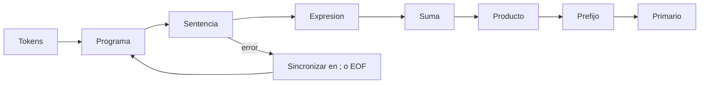

# 02. Parser: de tokens a estructura

**Estado:** draft  
**Modelo:** [`src/parser.rs`](../src/parser.rs)  
**Especificación:** [gramática del parser](specifications/02-parser.md)

## Concepto y problema

El parser recibe tokens y decide cómo se agrupan. La secuencia `1 + 2 * 3` no
contiene por sí sola la respuesta a su estructura: el lexer reconoce `+` y
`*`, pero la precedencia debe vivir en una gramática comprobable.

## Alternativas y decisión

El curso adopta descenso recursivo por niveles. Una función por nivel de
precedencia hace observable la regla: `parse_sum` consume productos y
`parse_product` consume prefijos. Un Pratt parser sería una alternativa sólida
para un lenguaje con muchos operadores; se difiere para no ocultar la primera
decisión de agrupamiento tras una tabla de enlaces.



## Implementación

`parse` tokeniza la entrada, conserva los diagnósticos léxicos y crea un
`ParsedProgram`. Este es un árbol sintáctico transitorio, no el AST canónico:
la fase siguiente fijará la representación que usará el análisis semántico.

```rust
use rust_compiler_design::parser::parse;

let result = parse("let total = 1 + 2 * 3; total;");
assert!(result.errors.is_empty());
assert_eq!(result.program.statements.len(), 2);
```

El ciclo en cada nivel vuelve asociativos a la izquierda los operadores
binarios. Por eso `8 - 3 - 1` se interpreta como `(8 - 3) - 1`.

## Diagnósticos y recuperación

Cuando falta un elemento sintáctico, el parser registra un `ParseError` y
avanza hasta `;` o `EOF`. No intenta adivinar una expresión válida: recuperar
es útil solo si preserva la honestidad del árbol producido.

Ejecuta el modelo y su prueba de integración con:

```text
cargo test --test parser
```

## Ejercicios

1. Añade una prueba que confirme que los paréntesis vencen la precedencia.
2. ¿Por qué una división encadenada también debe asociarse por la izquierda?
3. Diseña un punto de sincronización para sentencias delimitadas por salto de
   línea. ¿Qué error nuevo puede introducir?

## Soluciones orientativas

1. `parse("(1 + 2) * 3;")` debe producir una multiplicación cuyo operando
   izquierdo sea la suma. Los paréntesis se consumen en `parse_primary`.
2. `8 / 2 / 2` se interpreta normalmente como `(8 / 2) / 2`; un bucle por
   nivel conserva ese orden sin recursión hacia la derecha.
3. El salto de línea puede ser un delimitador, pero habría que definir cuándo
   es trivia y cuándo termina una sentencia, especialmente dentro de paréntesis.

## Límites

No hay llamadas, bloques, booleanos ni asignación como expresión. Tampoco hay
recuperación estructural más allá de sentencias. El modelo es seguro, estable y
sin dependencias externas.
