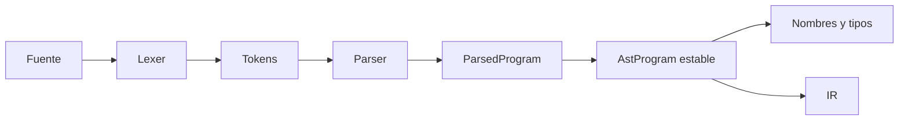

# 03. AST: una representación para las etapas posteriores

**Estado:** draft  
**Modelo:** [`src/ast.rs`](../src/ast.rs)  
**Especificación:** [contrato del AST](specifications/03-ast.md)

## Concepto y problema

El parser responde si una fuente sigue la gramática. El AST responde cómo se
representa esa estructura para que otras fases la recorran sin conocer el cursor
ni la recuperación del parser. Separarlos evita que análisis semántico y
lowering dependan de decisiones de reconocimiento local.

## Decisión de representación

El AST usa enums recursivos y `Box` para expresiones. Es una elección clara para
un árbol pequeño: cada variante hace visibles los datos que conserva y los
spans acompañan a los nodos para diagnósticos posteriores. Una arena sería útil
con grafos compartidos o análisis masivos, pero sería complejidad adelantada.



## Implementación

El modelo convierte `ParsedProgram` a `AstProgram`. La conversión conserva
sentencias, operandos y operadores, pero no resuelve nombres: `total` sigue
siendo texto hasta que la siguiente fase construya una tabla de símbolos.

```rust
use rust_compiler_design::{ast::AstProgram, lexer::Span, parser::parse};

let parsed = parse("let total = 2 + 3;");
let ast = AstProgram::from_parsed(parsed.program, Span::new(0, 18));
assert_eq!(ast.statements.len(), 1);
```

## Invariantes

- La conversión conserva el orden fuente de sentencias y operandos.
- Un nodo binario conserva explícitamente sus dos hijos y su operador.
- El AST no resuelve nombres ni asigna tipos.
- Los spans proporcionan el rango que cubre el programa y sus nodos durante
  esta transición; la fase semántica mantiene esa trazabilidad al diagnosticar.

## Ejercicios

1. ¿Qué variante agregarías para booleanos sin modificar la de enteros?
2. Compara el coste de usar `Box` con una arena de nodos para este lenguaje.
3. Diseña una prueba que demuestre que `a - b` no invierte sus operandos.

## Soluciones orientativas

1. `AstExpression::Boolean { value, span }` mantiene el enum exhaustivo.
2. `Box` asigna cada nodo de forma independiente y es sencillo de seguir; una
   arena reduce esa dispersión, pero añade índices, ciclos de vida o validación.
3. Convierte una expresión con dos identificadores distintos y verifica que
   `left` sea `a` y `right` sea `b`.

## Límites

No existen llamadas, bloques, tipos ni referencias resueltas. El AST no es una
representación optimizada ni una API de producción; es el contrato educativo
estable que conecta sintaxis con significado, sin `unsafe` ni dependencias.
