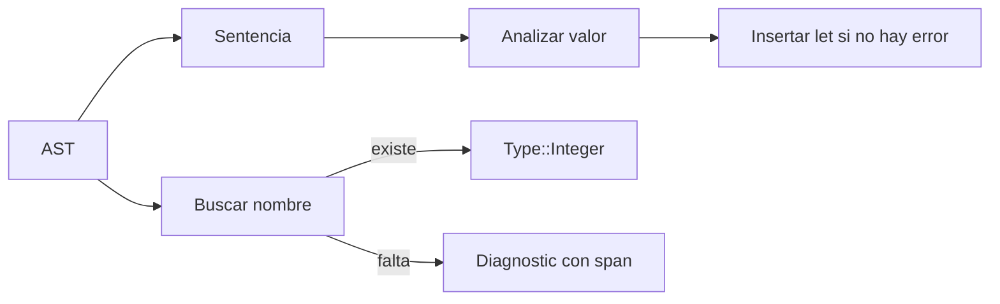

# 04. Semántica: cuando la sintaxis adquiere significado

**Estado:** draft  
**Modelo:** [`src/semantics.rs`](../src/semantics.rs)  
**Especificación:** [análisis semántico](specifications/04-semantics.md)

## Concepto y problema

Un parser acepta la forma de `missing + 1;`, pero no puede saber si `missing`
fue declarado. El análisis semántico recorre el AST con una tabla de símbolos y
convierte ese hueco en un diagnóstico preciso.

## Decisión

El primer scope usa `HashMap<String, Type>` y un único tipo, `Integer`. Es una
representación deliberadamente simple: muestra la diferencia entre declarar y
usar un nombre sin adelantar internamiento, inferencia o scopes anidados.



## Implementación

```rust
use rust_compiler_design::{ast::AstProgram, lexer::Span, parser::parse, semantics::analyze};

let parsed = parse("let total = 2; total + 3;");
let ast = AstProgram::from_parsed(parsed.program, Span::new(0, 25));
assert!(analyze(&ast).errors.is_empty());
```

El valor se analiza antes de insertar su binding. Por ello `let total = total;`
no puede leerse como una definición válida de sí misma.

## Ejercicios

1. Agrega una prueba para `let x = missing; x;`.
2. Diseña cómo introducirías `Boolean` sin permitir `1 + true`.
3. ¿Qué estructura necesitarías para scopes anidados?

## Soluciones orientativas

1. Debe producir un error para `missing` y no insertar `x`.
2. El enum `Type` crecería y cada operador comprobaría sus operandos.
3. Una pila de tablas permite buscar desde el scope más interno hacia fuera.

## Límites

No hay inferencia, coerciones ni scopes anidados. El resultado es evidencia de
un contrato mínimo, no un sistema de tipos completo.
