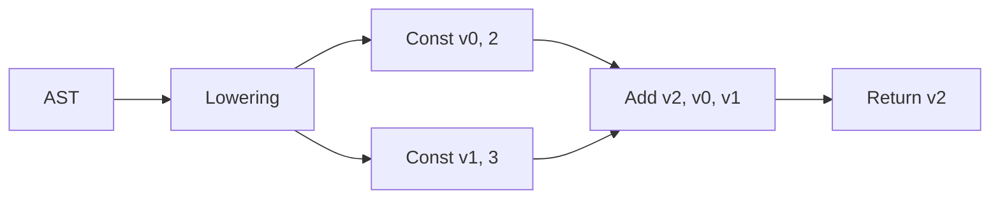

# 05. IR: linealizar significado para ejecutar y optimizar

**Estado:** draft  
**Modelo:** [`src/ir.rs`](../src/ir.rs)  
**Especificación:** [contrato de IR](specifications/05-ir.md)

## Concepto y problema

El AST explica la estructura fuente, pero para ejecutar `2 + 3` una fase
posterior necesita operaciones en orden. La representación intermedia (IR)
convierte árboles validados en instrucciones lineales con valores temporales.

## Alternativas y decisión

Adoptamos un bloque lineal con `ValueId`. Es suficiente para observar dataflow
y orden de evaluación. SSA con bloques y phi-nodos será útil cuando exista
control de flujo; incorporarlo ahora escondería el lowering esencial.



## Implementación

`lower` recorre los hijos de izquierda a derecha, emite instrucciones y asigna
un temporal nuevo para cada resultado. Los bindings se vuelven `Store` y los
usos de nombre se vuelven `Load`.

```rust
use rust_compiler_design::{ast::AstProgram, ir::lower, lexer::Span, parser::parse};

let parsed = parse("2 + 3;");
let ast = AstProgram::from_parsed(parsed.program, Span::new(0, 6));
assert_eq!(lower(&ast).instructions.len(), 4);
```

## Ejercicios

1. Dibuja las instrucciones para `let x = 4; x * 2;`.
2. ¿Por qué el temporario izquierdo debe producirse antes del derecho?
3. Propón una instrucción para negar un valor sin convertirla todavía en pase
   de optimización.

## Soluciones orientativas

1. Produce `Const`, `Store`, `Load`, `Const`, `Multiply` y `Return`.
2. Mantener el orden permite que futuras expresiones con efectos preserven su
   significado, incluso si el lenguaje inicial aún no los tiene.
3. `Neg { destination, operand }` es una posibilidad; el modelo actual la
   expresa como resta desde cero para mantener el conjunto mínimo.

## Límites

La IR no tiene CFG, saltos, funciones ni SSA. Tampoco optimiza: primero
preserva significado y deja evidencia verificable para el optimizador.
