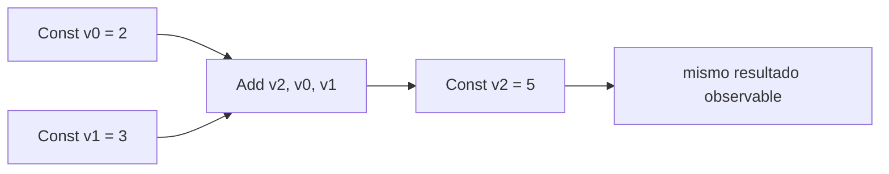

# 06. Optimizador: transformar con una prueba de significado

**Estado:** draft  
**Modelo:** [`src/optimizer.rs`](../src/optimizer.rs)  
**Especificación:** [pase local](specifications/06-optimizer.md)

## Concepto y problema

Una IR lineal puede contener trabajo que ya conocemos: `Const 2`, `Const 3`,
`Add` no necesita esperar a la máquina virtual. Optimizar no significa hacer
algo más rápido por intuición: significa reemplazar una forma por otra con el
mismo resultado observable.

## Decisión

El primer pase es folding local de constantes. Mantiene un mapa de temporales
conocidos y sustituye un binario solo cuando sus dos entradas están disponibles.
No pliega división entre cero y no reordena `Store` ni `Return`.



## Ejemplo

```rust
use rust_compiler_design::{ir::{Instruction, IrProgram, ValueId}, optimizer::fold_constants, parser::BinaryOperator};

let input = IrProgram { instructions: vec![
    Instruction::Const { destination: ValueId(0), value: 2 },
    Instruction::Const { destination: ValueId(1), value: 3 },
    Instruction::Binary { destination: ValueId(2), operator: BinaryOperator::Add, left: ValueId(0), right: ValueId(1) },
] };
assert!(matches!(fold_constants(&input).instructions[2], Instruction::Const { value: 5, .. }));
```

## Ejercicios y soluciones

1. ¿Por qué `Load` invalida una constante conocida? Porque su valor depende del
   entorno, no de la instrucción anterior.
2. Agrega una prueba para multiplicación. Debe plegarse igual que suma cuando
   ambos temporales son constantes.
3. ¿Por qué no plegar `1 / 0`? La ejecución debe conservar su error futuro.

## Límites

No hay eliminación de código muerto, propagación global ni benchmarks. El
propósito es aprender a exigir equivalencia antes de añadir un pase mayor.
