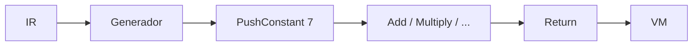

# 07. Bytecode: un contrato explícito con la máquina virtual

**Estado:** draft  
**Modelo:** [`src/bytecode.rs`](../src/bytecode.rs)  
**Especificación:** [bytecode](specifications/07-bytecode.md)

## Concepto

El bytecode es la frontera entre generar y ejecutar. Toma la IR y expresa sus
operaciones como instrucciones de pila que una máquina virtual puede recorrer
sin conocer AST, parser ni temporales.

## Decisión

La primera versión usa `OpCode` tipado. Un arreglo de bytes real es más compacto,
pero ocultaría decodificación y errores justo cuando el curso necesita mostrar
el contrato de cada instrucción.



## Ejemplo

```rust
use rust_compiler_design::{bytecode::{generate, OpCode}, ir::{Instruction, IrProgram, ValueId}};
let ir = IrProgram { instructions: vec![Instruction::Const { destination: ValueId(0), value: 7 }, Instruction::Return(ValueId(0))] };
assert_eq!(generate(&ir).instructions, vec![OpCode::PushConstant(7), OpCode::Return]);
```

## Ejercicios y soluciones

1. ¿Qué necesita verificar `Add`? Dos valores en la pila.
2. ¿Por qué `Store` contiene un nombre? El lenguaje aún usa bindings como
   texto; una tabla de slots es una optimización posterior.
3. ¿Cuándo añadirías una tabla de constantes? Cuando exista repetición medida.

## Límites

No hay saltos, serialización, frames ni tabla de constantes. Es un bytecode
pedagógico y seguro que privilegia inspección sobre compactación.
