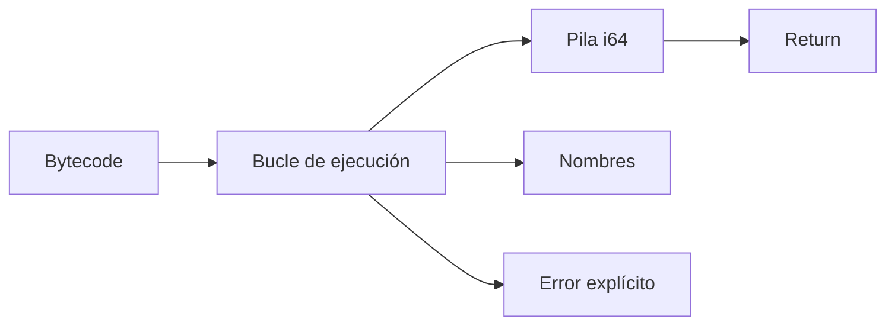

# 08. Máquina virtual: hacer observable el resultado del pipeline

**Estado:** draft  
**Modelo:** [`src/vm.rs`](../src/vm.rs)  
**Especificación:** [VM](specifications/08-vm.md)

## Concepto y problema

La VM es la última etapa: consume bytecode y hace observable el resultado del
programa. Una pila separa valores temporales del entorno de bindings y permite
que cada opcode tenga un efecto pequeño y verificable.



## Ejemplo

```rust
use rust_compiler_design::{bytecode::{Bytecode, OpCode}, vm::execute};
let program = Bytecode { instructions: vec![OpCode::PushConstant(2), OpCode::PushConstant(3), OpCode::Add, OpCode::Return] };
assert_eq!(execute(&program), Ok(5));
```

## Ejercicios y soluciones

1. ¿Qué pasa si `Add` recibe un solo valor? `StackUnderflow`.
2. ¿Por qué dividir entre cero no se oculta? Porque cambia el comportamiento
   observable y debe diagnosticarse.
3. ¿Qué añadir para llamadas? Frames, contador de programa y convenciones de
   argumentos; quedan fuera del lenguaje inicial.

## Límites

No hay saltos, funciones, GC ni serialización. Este modelo cierra el pipeline
educativo con un resultado verificable, no pretende ser una VM de producción.
